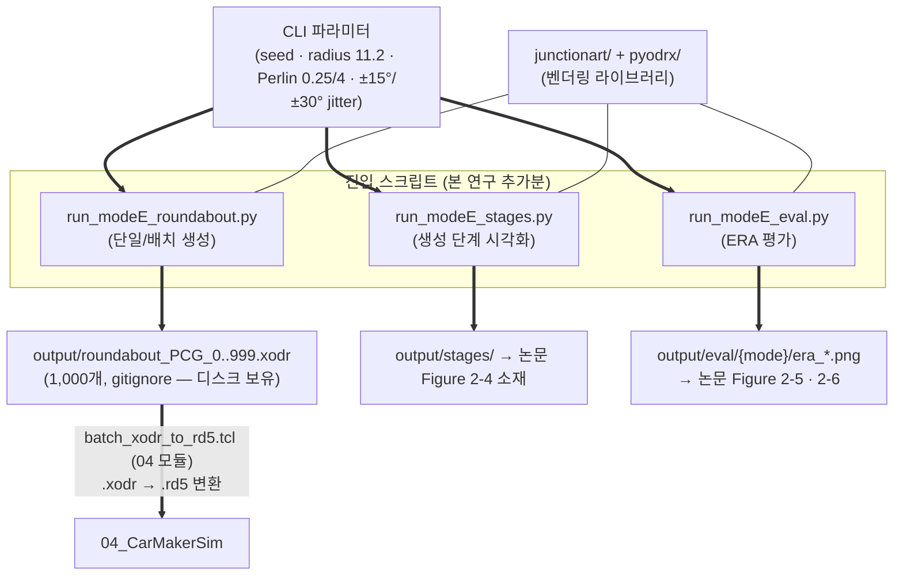

# 02_JunctionArt — 회전교차로 절차적 도로망 생성

4지 회전교차로 1,000개를 OpenDRIVE(`.xodr`)로 절차 생성하는 모듈. 제3자 라이브러리 **JunctionArt**(Ikram·Muktadir·Whitehead, IEEE IV 2023 — 논문 [30], MPL-2.0)를 벤더링하고, 본 연구의 실행 진입점(`run_modeE_*.py`)과 ERA 분석 코드(`analysis/metrics/roundabout/`)를 추가한 구조.

**파이프라인 위치**: 01(표적 회전교차로 식별) → **02: 도로망 생성** → 03(거동 파라미터 결합) → 04(CarMaker 시뮬레이션)

**논문 대응**: 2.4절 도로망 생성 (Figure 2-4 생성 3단계 · Figure 2-5 다양성 · Figure 2-6 현실성 ERA) · "1,000개의 회전교차로 도로망" · 식 (2.1)은 [30]의 사양 (본 데이터셋 생성에서는 `--radius 11.2` 고정으로 우회 — Notes 참조)

---

## Workflow — 스크립트 간 I/O 연결



입력 데이터 파일이 없는 유일한 모듈이다 — 모든 다양성은 CLI 파라미터(seed·Perlin)에서 나온다.

## Prerequisites

| 항목 | 요건 |
|------|------|
| Python | 3.9+ (시스템 3.11로 실행 검증됨, 2026-07-25 — conda 불필요) |
| 패키지 | `pip install -r ../requirements.txt` (PCG_dataSelection 루트의 통합 의존성 — numpy·scipy·matplotlib·seaborn·PyYAML·dill 등) |
| 외부 자원 | **없음** — 7개 모듈 중 유일하게 repo 단독으로 end-to-end 재실행 가능 |

## Running

```powershell
cd <repo>/test_layer/scripts/PCG_dataSelection/02_JunctionArt

# 단일 생성
python run_modeE_roundabout.py --seed 0 --nway 4 --radius 11.2 --output output/my_roundabout.xodr

# 졸업연구용 1,000개 배치 (논문 데이터셋 생성 명령 — README.md 참조)
for ($i=0; $i -lt 1000; $i++) {
  python run_modeE_roundabout.py --seed $i --radius 11.2 --noiseSeed $i `
    --distortionAmplitude 0.25 --noiseFrequency 4 --output output/roundabout_PCG_$i.xodr
}

python run_modeE_stages.py      # 생성 과정 단계별 그림 (Figure 2-4 소재)
python run_modeE_eval.py        # ERA 평가 (Figure 2-5 · 2-6)
```

**생성 파라미터 ↔ 논문 대응**:

| 파라미터 | 값 | 논문 |
|---|---|---|
| 기준 반지름 | `--radius 11.2` (고정) | p.26-27 — 식 (2.1)의 0.4·min_dist는 [30] 사양이며 본 데이터셋에선 미실행 (`ClassicGenerator.py`의 `overrideRadius` 우회) |
| 형상 왜곡 | Perlin `--distortionAmplitude 0.25 --noiseFrequency 4`, 12세그먼트 | Figure 2-5(a) 반지름 분포(≈7~15 m)의 실제 출처 |
| 진입 도로 | 위치 ±15° · heading ±30° jitter (`RandomRoadDefGenerator`) | p.27 '입력' 서술 |

## Outputs

| 산출물 | 내용 → 소비처 |
|--------|------|
| `output/roundabout_PCG_{0..999}.xodr` | 논문 데이터셋 도로망 1,000개. **gitignore** (디스크 보유, seed로 완전 재현 가능) → 04 모듈 `batch_xodr_to_rd5.tcl`의 입력 |
| `output/stages/seed{N}_*_stage{1-4}_*.png` | 생성 단계 시각화 → Figure 2-4 소재 |
| `output/eval/{mode}/era_*.png` | ERA(Expressive Range Analysis) → Figure 2-5(다양성)·2-6(현실성) |

## Notes

- **결정적 재현**: 도로망 1,000개는 seed만으로 재현된다 (seed 재생성본이 정본과 date 속성 제외 바이트 일치 확인) — `.xodr`을 커밋하지 않는 근거.
- **벤더링 출처**: github.com/Adhocmaster/junction-art (**MPL-2.0** — LICENSE 동봉). 본 연구 추가분은 `run_modeE_*.py` 3종 + `analysis/metrics/roundabout/` 3종. 상류의 교차로(intersection) 계열 미사용 모듈은 제거된 상태.
- **논문 정합**: 출판본 p.28 — 기준 반지름 11.2 m 고정, 형상 다양성은 Perlin noise 왜곡으로 부여 (코드와 일치).
