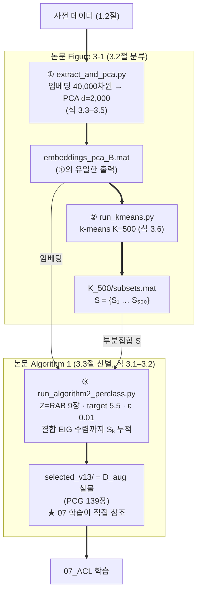

# 06_EIG — CP-CNN 임베딩 기반 Target-EIG 데이터 선별

> ### 공개 범위
>
> **코드는 전량 공개, 일부 데이터는 비공개.** 파이프라인 4케이스(PCG·realroad·CMO·Remix)의
> 스크립트와 분석 코드는 그대로 있다. 아래는 포함하지 않는다.
>
> | 제외 | 사유 |
> |------|------|
> | `Output/common/training_road_type_label.csv` | 실차 FOT 프레임별 라벨 테이블 |
> | `Output/realroad/**` (realroad EIG 선별 결과) | 실도로 FOT 계열 (논문 Case 4·8) |
> | `weight/cp_cnn_iter4.onnx` | 실차 데이터로 학습된 CP-CNN 가중치 |
> | `analysis/output/analysis2/fp_frame_metrics.csv` | 실차 프레임 단위 지표 |
>
> **PCG 계열 선별 결과는 그대로 포함**되어 있어, 논문의 제안 기법(C10) 산출물은 직접 확인할 수 있다.
> NAS 경로는 `<PROJECT_NAS>` 등 플레이스홀더로 치환되어 있다.

05의 DSM 이미지에서 CP-CNN 임베딩(`relu_Layer_3`)을 추출·PCA한 뒤, k-means(K=500) 서브셋 위에서
**per-class EIG(Expected Information Gain)** 로 증강 학습 데이터를 선별하는 모듈.
논문의 EIG 선별 4케이스가 동일한 파이프라인 사본으로 케이스 폴더에 대칭 배치된다.

**파이프라인 위치**: 05(DSM) → **06: 임베딩 → k-means → EIG 선별** → 07(학습 데이터 추가)

**논문 대응**: 3.2절 **Figure 3-1**(임베딩 → PCA → k-means = ①②) · 3.3절 **Algorithm 1**(목표 EIG 선별 = ③, Figure 3-2 수렴 이력) · 식 3.1~3.6 (V(X) 로그-행렬식, EIG = (V(F)−V(Z))/V(Z), d = 2,000 · 81.67%, K = 500, target 5.5 · ε 0.01)

---

## 1. 방법

### 1.1 본선 ① → ② → ③

CMO·Remix 케이스만 본선 앞에 ⓪ 증강 생성기(`cmo_augment.py` / `remix_augment.py`)가 하나 더 붙는다.
⓪의 출력 하위 폴더명 `LK_CIR_MER_RAB_FOT`는 07 학습 클래스 **규약명**일 뿐 시뮬레이션 산출물이 아니다
(CMO/Remix = 이미지 합성·재조합, 파일명 `Image_*_{CMO,Remix}_*.png`로 구분).

케이스별 RUN_NAME: PCG = `noLane_060126_sub4500`, realroad = `realFOT_noLane_061826_sub4500`.

### 1.2 ①이 요구하는 사전 데이터

| # | 데이터 | 저장소 | 비고 |
|---|--------|:---:|------|
| 사전1 | 라벨 CSV `training_road_type_label.csv` | ✕ | 실차 FOT 프레임 라벨 — 제외 |
| 사전2 | 케이스별 이미지 세트 (Z′) | ✕ | 05 산출 / ⓪ 산출 — 연구실 NAS |
| 사전3 | CP-CNN 모델 `cp_cnn_iter4.onnx` | ✕ | 실차 학습 가중치 — 제외. 내보내기 스크립트 `weight/export_iter4_onnx.m`는 포함 |
| 사전4 | 학습 SBEV 47,470장 (그중 **RAB 9장 = Algorithm 1의 Z**) | ✕ | proprietary — 산학과제 학습 데이터셋 |

> **논문 Table 2-3 (라벨 분포)**: j=4(RABaug) 분포만 본 저장소 계열 산출물이고, j=1~3은 선행 산학과제 학습 데이터셋을 근거로 한다.

### 1.3 부산물 (본선 미소비)

| 산출물 | 성격 | 소비자 |
|--------|------|--------|
| ② `K_500/subsets_dirs/` | 클러스터별 이미지 복사본 | 없음 — 육안 점검용 |
| ③ `selected_scenarios.csv` | 선별 목록 | `analysis/` 프레임 지표 |
| ③ `algorithm2_result.mat` | EIG 수렴 이력 (**Figure 3-2 소재**) | 기록용 |
| ③ `selected_subsets/` | 선택 클러스터별 복사본 | 없음 — 육안 점검용 |

## 2. 산출물 (저장소 포함)

| 경로 | 내용 |
|------|------|
| `results/eig_selection/PCG/noLane_060126_sub4500/K_500/subsets.mat` | ② k-means K=500 결과 |
| `results/eig_selection/PCG/noLane_060126_sub4500/K_500/selected_scenarios.csv` | **PCG EIG 선별 139장 목록** — 논문 제안 기법(C10)의 D_aug |
| `results/eig_selection/PCG/noLane_060126_sub4500/K_500/algorithm2_result.mat` | EIG 수렴 이력 (Figure 3-2) |
| `results/eig_selection/PCG/noLane_060126_sub4500/random_select/*` | 비교군 무작위 선별 (논문 C9) |
| `analysis/output/analysis1/` | **논문 Figure 2-5(a·b·c)** — 형상 다양성·현실성. `shape_stats.csv`, `shape_pool.npz`, `Table1_shape_diversity.csv` 포함 |
| `analysis/output/analysis2/` | **논문 Figure 3-3(a·b)** — ΔmTTCP 분포, FP 대역 농축 2.6% → 13.2%. `frame_metrics.csv` 포함 |

## 3. 재현

| 단계 | 저장소만으로 | 막히는 지점 |
|------|:---:|------|
| **선별 결과 확인** | **○** | `results/eig_selection/PCG/**` 로드 → 139장 목록·수렴 이력 확인 |
| **분석 그림 재현** | **△** | `analysis/` 코드와 산출 CSV·npz 포함. 원 이미지가 필요한 스텝은 막힘 |
| ① 임베딩 + PCA | ✕ | CP-CNN 가중치 + 이미지 세트 + SBEV 필요 |
| ② k-means | ✕ | ① 출력(`embeddings_pca_B.mat`) 필요 |
| ③ EIG 선별 | ✕ | ①② 출력 필요 |

**요건**: Python 3.9+ (numpy, scipy, pandas, scikit-learn, onnx, onnxruntime, Pillow, matplotlib, torch — 루트 `requirements.txt`). ③은 GPU 권장(iteration당 ~3분, CPU ~10분+), 없으면 `FORCE_CPU=True`.

**논문만으로 재구현하려면** — 식 3.1~3.6과 Algorithm 1이 논문에 있고, 하이퍼파라미터(d = 2,000, K = 500, target 5.5, ε 0.01, Z = RAB 9장)는 위에 명시했다. 임베딩 추출기(CP-CNN `relu_Layer_3`)만 대체하면 임의의 이미지 세트에 같은 절차를 적용할 수 있다.

## 4. Notes

- **①은 재실행해도 논문 임베딩이 재현되지 않는다.** 임베딩이 40,000차원이고 `n_components=2000`이라 sklearn `svd_solver='auto'`가 **randomized SVD**를 고른다. 정본 산출 당시 `random_state` 지정이 없어 같은 입력·같은 코드로도 매 실행마다 다른 PCA 축이 나오고, 그 여파로 k-means 클러스터와 선별 결과까지 달라진다 — 실측 **정본 139장 → 재실행 158장**, k-means 라벨 일치율 0.09%. 현재 코드는 `random_state=42`를 지정해 향후 실행은 재현되지만 **정본과는 값이 다르다**. 이 때문에 정본 선별 결과(`results/eig_selection/PCG/**`)를 저장소에 포함해 둔 것이다.
- **정본 검증 기록**: PCG 139/4,500, 최종 EIG 5.500004, 선택 클러스터 `[163, 492, 124, 45, 314, 432, 491, 482, 218]`.
- **`random_select/`의 동봉 기록은 구버전(150장) 실행분**이다. 논문 정본은 139장이며 스크립트 기본값도 `N_SELECT=139`이다.
- **`Output/common/road_type_distribution.png`은 고아 파일**이다 — 이 그림을 만든 라벨 CSV가 제외되어 재생성할 수 없다.
- **`analysis/`는 EIG 파이프라인과 독립**이다. analysis1 = Figure 2-5, analysis2 = Figure 3-3. `Utils/`(지표 라이브러리)와 `scripts/validation/`(구현 검증 7종)이 뒷받침한다. 일부 검증 스크립트는 제외된 실측 도로 파일을 참조하므로 그대로는 실행되지 않는다.
